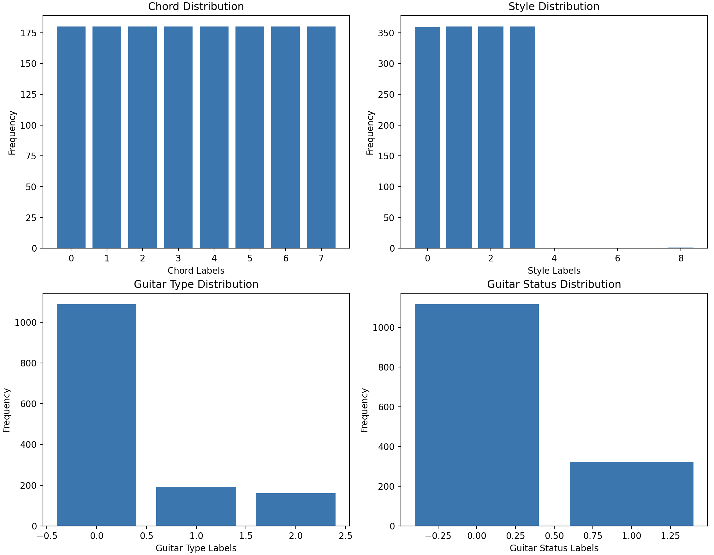
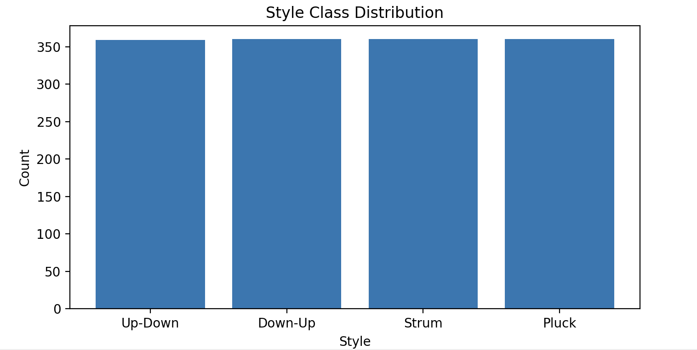
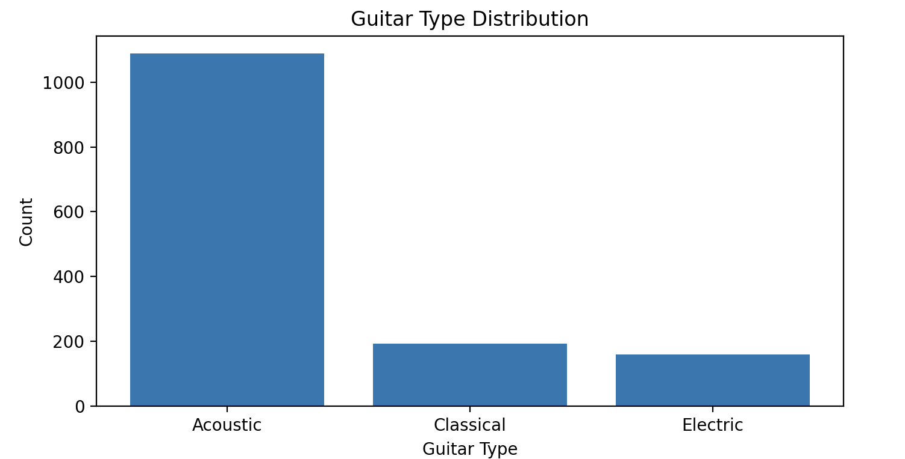
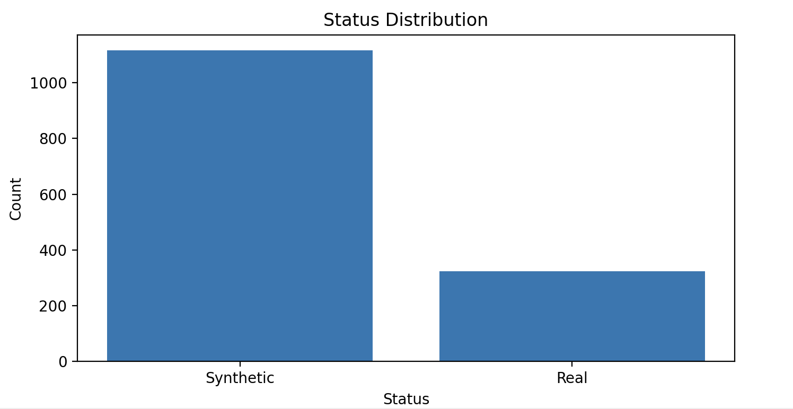
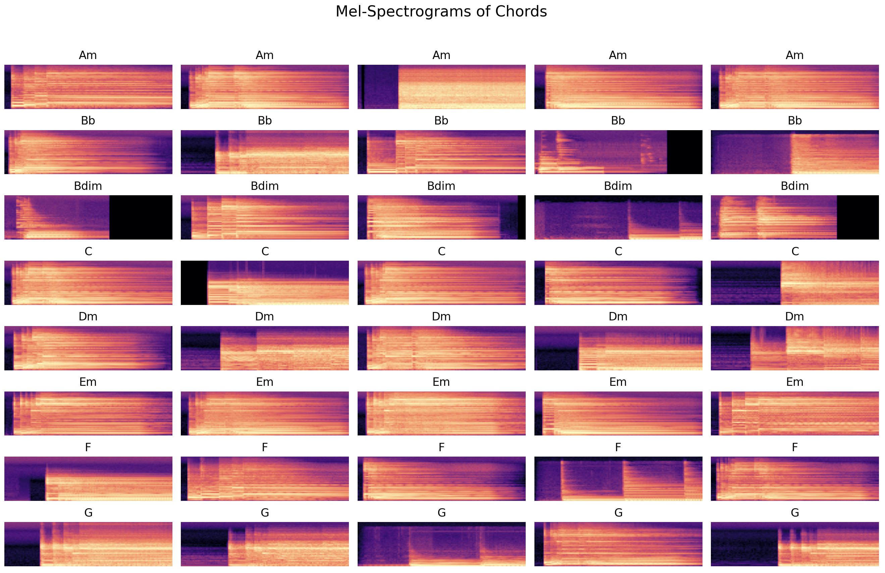

# 🎸 Chordformer: Revolutionising Guitar Chord Recognition with Deep Learning

Chordformer leverages advanced deep learning techniques to significantly improve guitar chord classification accuracy

## Project Overview
Chordformer is an advanced deep learning model designed to tackle the challenging problem of guitar chord classification. By integrating **Convolutional Neural Networks (CNNs)** with **self-attention mechanisms**, Chordformer sets a new benchmark in chord recognition. The hybrid architecture excels in analysing complex audio patterns, offering transformative potential in areas like automated music transcription and real-time audio processing.

> "This hybrid approach promises to advance applications in automated music transcription, real-time chord recognition, and audio signal processing, contributing a powerful tool for complex music analysis tasks."

## 🎯 Motivation and Objectives
### Why Chordformer?
Traditional approaches to chord recognition often fall short when dealing with the complexity of real-world music. CNNs, while effective for feature extraction, lack the ability to model the temporal dependencies crucial for understanding musical structures. Chordformer addresses these shortcomings by embedding **attention-based mechanisms** that capture both the local and global patterns in audio data.

### Key Objectives:
- **Enhance Classification Accuracy**: Employing attention mechanisms to identify subtle nuances and variations in guitar chords.
- **Improve Model Generalisation**: Ensuring robust performance across different playing styles and guitar types.
- **Facilitate Model Interpretability**: Making the model's decisions transparent and explainable.

> “By achieving these aims, Chordformer aspires to make a meaningful contribution to automated music transcription, music information retrieval, and audio signal processing.”

## ⚙️ Technical Approach
### Problem Statement
> “CNNs excel at capturing local features but struggle to model long-range dependencies essential for complex chord progressions and transitions.”

### Solution: Hybrid Model Architecture
1. **CNNs for Feature Extraction**: Leveraging **Mel-spectrograms** as input, CNN layers extract critical harmonic and tonal features from the audio data.
2. **Attention Mechanisms for Contextual Understanding**: Self-attention and bi-directional attention layers are integrated to address the limitations of CNNs, providing the ability to capture relationships across the entire input sequence.
3. **Transformer Layers for Long-Term Dependencies**: By incorporating Transformer encoder layers, Chordformer models the intricate dependencies in chord progressions, offering a holistic understanding of musical sequences.

> “Integrating self-attention layers within CNN architectures enhances the model’s ability to capture long-term dependencies while retaining CNNs’ strengths in local feature extraction.”

## 📊 Dataset Overview

Our dataset features a variety of guitar chords, playing styles, and guitar characteristics, collected and processed for effective training and evaluation. Here’s a detailed look at the dataset distributions:

### 1. **Chord Distribution**
The dataset comprises eight guitar chords: Am, Bb, Bdim, C, Dm, Em, F, and G. Each chord is **uniformly distributed**, ensuring a balanced representation and giving the model equal exposure to all chord types during training. This balance is essential for preventing bias and achieving robust chord classification performance.

### 2. **Style Distribution**
We have four distinct playing styles: Up-Down, Down-Up, Strum, and Pluck. These styles are also evenly represented in the dataset, which helps the model learn the unique characteristics of each style. With consistent sample distribution across all styles, the model can better generalise to different playing techniques.

### 3. **Guitar Type Distribution**
The dataset contains three types of guitars: Acoustic, Classical, and Electric. However, there is a **significant imbalance**, with Acoustic guitars being the most frequently represented. Classical and Electric guitars have far fewer samples, posing a potential challenge for model generalisation. This imbalance will be addressed with techniques such as data augmentation or class weighting during training to mitigate any performance degradation.

### 4. **Guitar Status Distribution**
The guitar recordings are categorised as either Synthetic or Real. The dataset shows a **notable skew**, with synthetic recordings being far more prevalent than real recordings. This bias could impact the model's ability to perform well on real-world data, necessitating careful consideration in model training and evaluation.

### 5. **Mel-Spectrogram Samples**
We visualise Mel-spectrograms for different guitar chords, showing five samples per chord. These spectrograms reveal the intricate frequency patterns that our model will learn to differentiate. Each spectrogram captures the harmonic structure and transient features of guitar chords, which are crucial for accurate classification. The spectrograms highlight the spectral diversity across chords, helping us understand the model's learning challenge.

## 🛠️ Model Architecture Overview
Chordformer is built with a modular architecture that combines cutting-edge techniques from both convolutional and attention-based neural networks. This design is specifically tailored to handle the complexity of guitar audio signals, accounting for variations in guitar type, playing styles, and whether the sound is synthesised or real. The architecture is carefully constructed to extract and understand rich audio features, focus on important sound patterns, and ultimately perform accurate classifications across multiple dimensions of guitar sounds.

### 1. Feature Extraction Block
The Feature Extraction Block is the first stage of the Chordformer architecture, designed to process raw Mel-spectrogram inputs. Mel-spectrograms are widely used representations in audio analysis, capturing both frequency and time-domain information in a way that mimics the human ear's perception of sound. This block employs multiple frequency-distributed convolutional operations to separately process different frequency bands, which is crucial for capturing the subtle spectral variations between guitar chords.

Each convolutional layer is followed by batch normalisation and activation functions to ensure the stability and non-linearity of the model. The block ends with a pooling layer to reduce the feature map size, making the subsequent computations more efficient. By focusing on local frequency features, this component sets the stage for more sophisticated processing later in the network. The approach is inspired by research highlighting that "local frequency bands, when processed separately, enable models to capture intricate spectral details more efficiently" (Hinrichs et al., 2022).

### 2. Attention Encoding Block
The Attention Encoding Block is where Chordformer introduces a self-attention mechanism to capture long-term dependencies and contextual relationships within the audio data. Traditional CNNs are effective at local feature extraction but often fall short when it comes to understanding broader temporal patterns in audio sequences. To address this limitation, Chordformer incorporates a Transformer-based approach inspired by the foundational work "Attention Is All You Need" (Vaswani et al., 2017).

This block starts by applying additional convolution and normalisation operations to prepare the feature maps. It then uses a self-attention mechanism, which allows the model to weigh different parts of the audio signal based on their importance, effectively learning to focus on the most relevant features for chord recognition. Positional encoding is added to retain the order of the audio sequence, which is critical for understanding temporal relationships. Finally, a Transformer encoder processes the enriched feature representation, leveraging multiple layers to deepen the model's understanding of the input.

The integration of attention mechanisms is crucial because, as Gong et al. (2021) explain, "Transformers have a unique ability to capture long-term dependencies, which is essential for tasks like music analysis where patterns unfold over time."

### 3. Classification Block
The Classification Block is the final stage of the architecture, responsible for making predictions based on the features extracted and encoded in the previous stages. It outputs four distinct classifications: the type of guitar chord being played, the playing style, the guitar type (e.g., acoustic, classical, electric), and whether the audio is real or synthetic.

To achieve this, the block uses embedding layers for categorical features like guitar type and status. These embeddings convert categorical information into dense, continuous representations, making it easier for the neural network to process them. The features from the attention encoding stage are combined with these embeddings, and the combined representation is passed through a series of linear layers with dropout regularisation to prevent overfitting. The block outputs predictions using separate linear layers for each classification task. The use of embeddings aligns with findings by Jadhav et al. (2022), who note that "embedding layers are essential for effectively capturing categorical data and enhancing model accuracy."

### The Power of Self-Attention and CNNs
By combining convolutional layers with self-attention mechanisms, Chordformer benefits from the strengths of both approaches. Convolutional layers excel at local feature extraction, capturing intricate details in the audio signal, while self-attention mechanisms provide a global understanding, ensuring the model can recognise complex and temporally distributed patterns.

Chordformer’s architecture is meticulously designed to handle the unique challenges of guitar chord classification. By using advanced feature extraction techniques, attention mechanisms for temporal understanding, and robust classification strategies, the model can deliver high accuracy across multiple audio dimensions. It leverages the best practices and insights from recent research in music information retrieval and deep learning, making it a cutting-edge tool in the field of audio classification.

This architecture serves as a testament to the importance of combining traditional convolutional methods with modern self-attention techniques to achieve state-of-the-art performance in complex audio analysis tasks.

This hybrid approach is particularly effective for music analysis, as noted by Kim et al. (2017): "Sample-level CNN architectures are powerful for music tagging, but their performance significantly improves when combined with attention mechanisms that can capture long-term dependencies."
> “The introduction of guitar-type embeddings aims to improve the model’s ability to generalise across various guitar types.”

## 📊 Performance and Results
### Model Training and Validation
The model underwent extensive training, achieving impressive accuracy across multiple metrics:
- **Chord Recognition**: Significant improvements were observed, with validation accuracy stabilsing at high levels.
- **Style and Status Recognition**: Near-perfect accuracy for recognising playing styles and distinguishing between synthetic and real recordings.
- **Generalisation**: Chordformer demonstrated robust performance, even under varying recording conditions.

> “The model quickly reaches 90.97% validation accuracy by epoch 5 and achieves near-perfect accuracy of 99.31% by epoch 33.”

### Precision Per Chord
- **Am, Bb, Bdim, C, Dm, Em, F, G**: Achieved precision rates of up to **1.00** for several chords, indicating exceptional performance in chord recognition.

> “Attention mechanisms not only improve classification accuracy but also offer enhanced interpretability.”

## 🔍 Data Insights
Chordformer uses a rich and diverse dataset that includes:
- **Multiple Guitar Types**: Acoustic, classical, and electric, ensuring the model's adaptability.
- **Various Playing Styles**: Including up-down and down-up strumming patterns to simulate real-world scenarios.
- **Balanced Data Distribution**: The dataset is carefully curated to prevent bias towards any particular chord or style.

> “Chordformer will push the boundaries of chord classification technology, with potential applications in digital music platforms, educational tools, and real-time performance systems.”

## 🏆 Impact and Applications
Chordformer holds promise for a wide range of applications:
1. **Music Transcription**: High-precision chord detection for musicians, enabling easier composition and analysis.
2. **Educational Tools**: Interactive learning platforms for guitar students, providing real-time feedback.
3. **Live Performances**: Real-time chord recognition for artists, enhancing stage performances and improvisation.
4. **Streaming Platforms**: Integration into music streaming services for automated song analysis and recommendation.

> “This model is poised to revolutionise chord classification in both academic research and commercial applications.”

# References

• Choi, Keunwoo Fazekas, Gyo ̈rgy Sandler, Mark Cho, Kyunghyun. (2017). Convolutional recurrent neural networks for music classification

Available at: https://arxiv.org/abs/1609.04243 

[Online]

[Accessed 14 September 2024].

• Gong, Yuan Chung, Yu-An Glass, James. (2021). AST: Audio Spectrogram Transformer 

Available at: https://arxiv.org/pdf/2104.01778

[Online]

[Accessed 16 September 2024].

• Hinrichs, Reemt Gerkens, Kevin Lange, Alexander Ostermann, Jo ̈rn. (2022). Convolutional neural networks for the classification of guitar effects and extraction of the parameter settings of single and multi-guitar effects from instrument mixes

[Online]

Available at:
https://www.researchgate.net/publication/364655306 Convolutional neural networks for the classification of guitar effects guitar effects from instrument mixes

[Accessed 1 September 2024].

• Islam, Samiul Haque, Md Sadat, Abu. (2023). Capturing Spectral and Long-term Contextual
Information for Speech Emotion Recognition Using Deep Learning Techniques

[Online]

Available at: https://arxiv.org/abs/2308.04517 [Accessed 3 August 2024].

• Jadhav, Yogesh Patel, Ashish Jhaveri, Rutvij Raut, Roshani. (2022). Transfer Learning for Audio Waveform to Guitar Chord Spectrograms Using the Convolution Neural Network. Mobile Information Systems

[Online]

Available at:
https://www.researchgate.net/publication/252067543 Neural networks musical chords recognition

[Accessed 21 September 2024].

• Kim, T., Lee, J., Nam, J. (2017). Sample-level CNN architectures for music auto-tagging using raw
waveforms.

[Online]

Available at: https://arxiv.org/pdf/1710.10451 [Accessed 3 August 2024].

• Kristian, Yosi Zaman, Lukman Tenoyo, Michael Jodhinata, Andreas. (2024). Advancing Guitar Chord Recognition: A Visual Method Based on Deep Convolutional Neural Networks and Deep Transfer Learning

[Online]

Available at:
https://www.researchgate.net/publication/380532263 Advancing Guitar Chord Recognition A Visual Method Based on De

[Accessed 30 September 2024].

• Lan, Yun-Han Hsiao, Wen-Yi Cheng, Hao-Chung Yang. (2024). MusiConGen: Rhythm and Chord
Control for Transformer-Based Text-to-Music Generation

[Online]

Available at: https://arxiv.org/abs/2407.15060 [Accessed 30 September 2024].

• Lee, J., Kim, T., Park, J., Nam, J. (2017). Raw Waveform-based Audio Classification Using Sample-level CNN Architectures.

[Online]

Available at: https://arxiv.org/abs/1712.00866 [Accessed 3 August 2024].

• Lee, J., Kim, T., Park, J., Nam, J (2019). Comparison and Analysis of SampleCNN Architectures for Audio Classification

[Online]

Available at: https://ieeexplore.ieee.org/document/8681654 [Accessed 4 August 2024].

• Li, Tom Chan, Antoni Chun, Andy. (2010). Automatic Musical Pattern Feature Extraction Using Convolutional Neural Network. Lecture Notes in Engineering and Computer Science. 2180.

[Online]

Available at:
https://www.researchgate.net/publication/44260643 Automatic Musical Pattern Feature Extraction Using Convolutional N

[Accessed 4 August 2024].

• Park, J., Choi, K., Jeon, S., Kim, D., Park, J. (2019). A bi-directional transformer for musical chord
recognition

[Online]

Available at: https://arxiv.org/abs/1907.02698 [Accessed 30 August 2024].

• S. Kim, T. Hayashi and T. Toda. (2022). Note-level Automatic Guitar Transcription Using Attention Mechanism

[Online]

Available at: https://ieeexplore.ieee.org/document/9909659 [Accessed 29 August 2024].

• Vaswani, A., Shazeer, N.M., Parmar, N., Uszkoreit, J., Jones, L., Gomez, A.N., Kaiser, L., Polosukhin, I. (2017) Attention Is All You Need

[Online]

Available at: https://arxiv.org/abs/1706.03762 [Accessed 25 August 2024].

• Wise, Andrew Maida, Anthony Kumar, Ashok. (2021). Attention Augmented CNNs for Musical Instrument Identification

[Online]

Available at:
https://www.researchgate.net/publication/356890333 Attention Augmented CNNs for Musical Instrument Identification

[Accessed 28 August 2024].

• Won, M., Ferraro, A., Bogdanov, D., Serra, X. (2020). Evaluation of CNN-based Automatic Music
Tagging Models

[Online]

Available at: https://arxiv.org/abs/2006.00751 [Accessed 29 August 2024].

• Yu Wu, Hua Mao, Zhang Yi. (2018). Audio classification using attention-augmented convolutional neural T network
https://www.sciencedirect.com/science/article/abs/pii/S0950705118303848 [Accessed 30 September 2024].

• Xie, Changjiang Song, Huazhu Zhu, Hao Mi, Kaituo Li, Zhouhan Zhang, Yi Cheng, Jiawen Zhou, Honglin Li, Renjie Cai, Haofeng. (2023) Music genre classification based on res-gated CNN and attention mechanism. Multimedia Tools and Applications

[Online]

Available at:
https://www.researchgate.net/publication/372162077 Music genre classification based on res- gated CNN and attention mechanism

[Accessed 4 August 2024].

• Xuran Pan; Chunjiang Ge; Rui Lu; Shiji Song; Guanfu Chen; Zeyi Huang; Gao Huang. (2023) On
the Integration of Self-Attention and Convolution

[Online]

Available at: https://arxiv.org/abs/2111.14556 [Accessed 4 August 2024]. 

• Yu Wu, Hua Mao, Zhang Yi. (2018). Audio classification using attention-augmented convolutional neural network

[Online]

Available at: https://www.sciencedirect.com/science/article/abs/pii/S0950705118303848 [Accessed 26 August 2024].

• Zhang, Zhongxia Wang, Mingwen. (2022). Convolutional Neural Network with Convolutional Block Attention Module for Finger Vein Recognition

[Online]

Available at: https://arxiv.org/abs/2202.06673 [Accessed 3 August 2024].